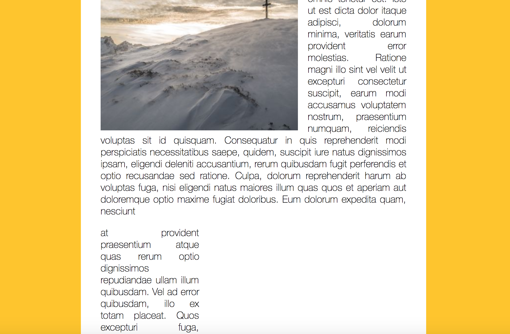

# Slide in on Scroll

## Objective: 
Scroll to the point on the DOM to which images slide in.

### Debouncing
Use debounce function to avoide performance issues. We use debounce to only run this function at most, however many seconds. Pass at a function and it will run debounce all the time when we scroll but will run the checkSlide function once every 20 miliseconds or 100 miliseconds. 

We wrap the checkSlide into the debounce function 

``window.addEventListener('scroll', debounce(checkSlide));``

### Check Slider Images

``function checkSlide(e){
      console.log(window.scrollY);
      sliderImages.forEach(sliderImage => {
        //half way through the image
        const slideInAt = (window.scrollY + window.innerHeight) - sliderImage.height / 2;
       //top of image how far from the window//
        const imageBottom = sliderImage.offsetTop + sliderImage.height;
        const isHalfShown = slideInAt > sliderImage.offsetTop;
        const isNotScrolledPast = window.scrollY < imageBottom;
        if(isHalfShown && isNotScrolledPast){
          sliderImage.classList.add('active');
        } else{
          sliderImage.classList.remove('active');
        }
      });
    }``